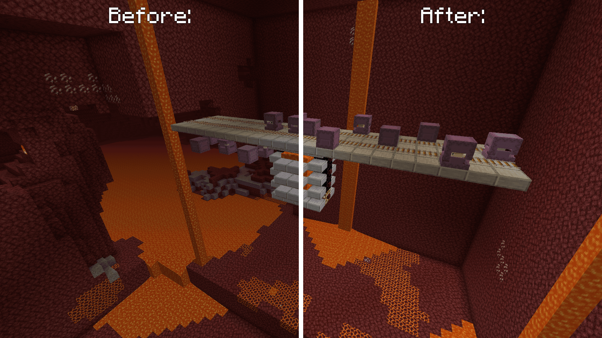

# Farmable Shulkers (Fabric)
[](https://github.com/Kir-Antipov/farmable-shulkers/releases/latest)
[](https://github.com/Kir-Antipov/farmable-shulkers/actions/workflows/build-artifacts.yml)
[![Modrinth](https://img.shields.io/badge/dynamic/json?color=5da545&label=Modrinth&query=title&url=https://api.modrinth.com/api/v1/mod/farmable-shulkers&style=flat&cacheSeconds=3600&logo=data:image/svg+xml;base64,PHN2ZyB4bWxucz0iaHR0cDovL3d3dy53My5vcmcvMjAwMC9zdmciIHZpZXdCb3g9IjAgMCAxMSAxMSIgd2lkdGg9IjE0LjY2NyIgaGVpZ2h0PSIxNC42NjciICB4bWxuczp2PSJodHRwczovL3ZlY3RhLmlvL25hbm8iPjxkZWZzPjxjbGlwUGF0aCBpZD0iQSI+PHBhdGggZD0iTTAgMGgxMXYxMUgweiIvPjwvY2xpcFBhdGg+PC9kZWZzPjxnIGNsaXAtcGF0aD0idXJsKCNBKSI+PHBhdGggZD0iTTEuMzA5IDcuODU3YTQuNjQgNC42NCAwIDAgMS0uNDYxLTEuMDYzSDBDLjU5MSA5LjIwNiAyLjc5NiAxMSA1LjQyMiAxMWMxLjk4MSAwIDMuNzIyLTEuMDIgNC43MTEtMi41NTZoMGwtLjc1LS4zNDVjLS44NTQgMS4yNjEtMi4zMSAyLjA5Mi0zLjk2MSAyLjA5MmE0Ljc4IDQuNzggMCAwIDEtMy4wMDUtMS4wNTVsMS44MDktMS40NzQuOTg0Ljg0NyAxLjkwNS0xLjAwM0w4LjE3NCA1LjgybC0uMzg0LS43ODYtMS4xMTYuNjM1LS41MTYuNjk0LS42MjYuMjM2LS44NzMtLjM4N2gwbC0uMjEzLS45MS4zNTUtLjU2Ljc4Ny0uMzcuODQ1LS45NTktLjcwMi0uNTEtMS44NzQuNzEzLTEuMzYyIDEuNjUxLjY0NSAxLjA5OC0xLjgzMSAxLjQ5MnptOS42MTQtMS40NEE1LjQ0IDUuNDQgMCAwIDAgMTEgNS41QzExIDIuNDY0IDguNTAxIDAgNS40MjIgMCAyLjc5NiAwIC41OTEgMS43OTQgMCA0LjIwNmguODQ4QzEuNDE5IDIuMjQ1IDMuMjUyLjgwOSA1LjQyMi44MDljMi42MjYgMCA0Ljc1OCAyLjEwMiA0Ljc1OCA0LjY5MSAwIC4xOS0uMDEyLjM3Ni0uMDM0LjU2bC43NzcuMzU3aDB6IiBmaWxsLXJ1bGU9ImV2ZW5vZGQiIGZpbGw9IiM1ZGE0MjYiLz48L2c+PC9zdmc+)](https://modrinth.com/mod/farmable-shulkers)
[](https://www.curseforge.com/minecraft/mc-mods/farmable-shulkers)
[](https://github.com/Kir-Antipov/farmable-shulkers#readme)

1.17 introduced us to a new mechanic that turns shulker shells into a renewable resource. The purpose of this mod is to port this behavior to older versions *(1.14.x, 1.15.x and 1.16.x)*.

Let the farming begin!

----

## Why not just update to 1.17?

Personally, I have 2 reasons for this:

 1. Just like many others, I was waiting for the Caves & Cliffs update. However, it was decided to split it into several versions *(and this isn't bad. It's better to delay a release of a large-scale update, than to provide players with something unfinished)*. I'll wait for the final release, which should happen at the end of 2021, in order to get the full impression of the update, and not to regenerate unused chunks several times. I can live without copper, candles, moss and glow squids, but mechanics of farmable shulkers is a killer feature for me.

 2. Servers are more difficult to update than single worlds, so it makes even more sense for them to wait for the final part of the update.

## Features

### Duplication of shulkers

New shulkers now have a chance to spawn when one shulker hits another shulker with a shulker bullet.


### Shulkers can travel to the Nether just like other entities

You might be surprised, but until the latest snapshots of 1.17, this didn't really work; shulkers preserved their coords as they moved to another dimension *(`800 ~ 800 -> 800 ~ 800` instead of `800 ~ 800 -> 100 ~ 100`)*.


### Shulkers can no longer teleport to non-square surfaces

For some reason, the game made sure that only the top of a block was a non-empty square surface, even if shulker tried to teleport to its bottom or side.

This is most easily illustrated with slabs:



## Looks cool, but how in the world can I use it to build a farm?

When something seems impossible to you, know that SciCraft members have already done it. So I recommend you to watch these videos:

 1. [Fully Automatic Shulker Shell Farm 20w45a, ilmango](https://www.youtube.com/watch?v=8RqWiEJuauQ) *(initial design, exploits a bug with incorrect teleportation of shulkers to the Nether. However, the video still has value as a brief explanation of the idea itself)*
 2. [Building the Reliable Shulker Farm for 1.17, cubicmetre](https://www.youtube.com/watch?v=owoS_bgOIhQ&t=637s) *(good to go bug-free design)*

## Installation

Requirements:
 - Minecraft `1.14.x`
 - Fabric Loader `>=0.7.0`

You can download the mod from:

 - [GitHub Releases](https://github.com/Kir-Antipov/farmable-shulkers/releases) <sup><sub>(recommended)</sub></sup>
 - [Modrinth](https://modrinth.com/mod/farmable-shulkers)
 - [CurseForge](https://www.curseforge.com/minecraft/mc-mods/farmable-shulkers)
 - [GitHub Actions](https://github.com/Kir-Antipov/farmable-shulkers/actions/workflows/build-artifacts.yml) *(these builds may be unstable, but they represent the actual state of the development)*

## Building from sources

Requirements:
 - JDK `8`

### Linux/MacOS

```cmd
git clone https://github.com/Kir-Antipov/farmable-shulkers.git
cd farmable-shulkers

chmod +x ./gradlew
./gradlew build
cd build/libs
```
### Windows

```cmd
git clone https://github.com/Kir-Antipov/farmable-shulkers.git
cd farmable-shulkers

gradlew build
cd build/libs
```